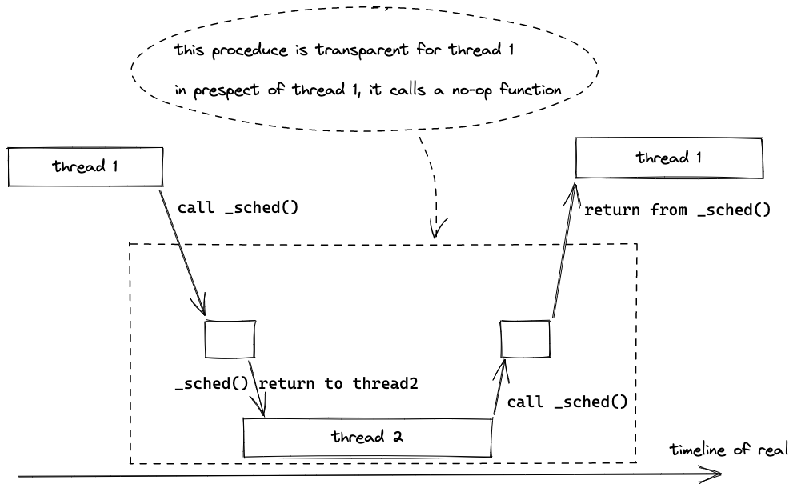

# OS Lab 3

Handin commit hash: `git checkout c2273d67f1c90c7780fdfb3576fcd8dc6e37754e`

I speed timer up to 1ms to test if it works well with interuption. In every timer interuption it print out a log, so it looks a little bit mess...

To filter clock info: `cmake .. && make qemu | grep -E -v "CPU [[:digit:]]+: clock"`

To print log until test pass:`cmake .. && make qemu | sed '/proc_test PASS/q'`

## Non-preemptive schedule

In this lab, we implement a *non-preemptive* kernel thread. Thread calls `_sched()` to give up CPU, instead of interupted by hardware (we do have the clock enabled, but we do NOT schedule during the interuption).

Compared with *preemptive schedule*, thread has saved all caller-saved registers before calling function `_sched()` (thanks to compiler). Jobs left for `_sched()` are (1) choosing another thread to keep going, (2) saving any other internal state (the stack pointer, program counter, and all callee-saved registers) and (3) switching to that thread.

Let's implement (3) first, which is so-called **mechanism** part in this class.

## Mechanism 1: How to switch threads?

Remember in Attack Lab (of CSAPP), we evilly change the content of address where function caller saves the return address and it turns out when function callee returns, control is in our hands!

Take it easy, we are the Benevolent Dictator instead of attacker this time. We carefully replace the return address with another thread, so that when `_sched()` returns the new thread gets the control. Sometimes in the future, the old thread gets the control and it looks like nothing happend but just a sub-rountine call. Great job!



In Procedure Call Standard(PCS) of Arm architecture, caller saves the return address in `X30` register (also known as link register `LR`). So we replace this register and carefully save the old value somewhere.

Next we implement (2).

## Mechanism 2: How to save registers?

Since threads have their own stack, we simply save all registers in the stack and save the address to `old_ctx_ptr`. Respectively, we restore the content pointed by `new_ctx` to registers. The assembly code is similar to the following pseudo-code:

```c
void swtch(KernelContext *new_ctx, KernelContext **old_ctx_ptr)
{
  KernelContext old_ctx; // allocate space in stack to save old context


  // store all callee-saved registers in old_ctx
  asm("str x19, %0"::"m"(&old_ctx.x19));
  // ...
  asm("str x30, %0"::"m"(&old_ctx.x30));

  *old_ctx_ptr = &old_ctx;

  // restore new_ctx to register
  asm("ldr %0, x19" ::"rm"(new_ctx->x19));
  // ...
  asm("ldr %0, x30" ::"rm"(new_ctx->x30));

  return;
}
```

For a first-entered thread, we need to place the arguments in caller-saved registers. Here we use a trick. Since first-entered threads do not use these callee-saved registers, we can use them to save parameters that parent thread pass on.

```C
struct KernelContext
{
    // x19-x30 are callee-saved register

    u64 x19; /* for new process, x19 is used as x30 */
    u64 x20; /* for new process, x20 is used as x0(argc) */
    u64 x21; /* for new process, x21 is used as x1(argv) */
    u64 x22;
    u64 x23;
    u64 x24;
    u64 x25;
    u64 x26;
    u64 x27;
    u64 x28;
    u64 x29; /* x29 is also used as frame pointer */
    u64 x30; /* x30 is also used as return address */
};
```

When creating new thread, we save the real entry in `x19` field of `KernelContext`. `x30` saves `proc_entry` instead. `proc_entry` simply move those parameters and return to real entry (a simple version of [glibc `_start`](https://github.com/qsliu2017/glibc/blob/master/sysdeps/aarch64/start.S)).

```c
void proc_entry()
{
  asm(
    "mov x30, x19\n\t"
    "mov x0, x20\n\t"
    "mov x1, x21\n\t"
  );
}
```

Finally we implement (1), so-called **policy** part.

## Policy: Which thread to choose?

We simply use FCFS algorithm to choose next thread. Since several CPUs might schedule at the same time, a spinlock is required.

## Real World `setjmp`/`longjmp`

C standard library provides [`setjmp`](https://en.cppreference.com/w/c/program/setjmp) to save the current execution context into a variable env of type `jmp_buf`, and [`longjmp`](https://en.cppreference.com/w/c/program/longjmp) to restore the current execution context from that variable later.

Our implementation of `_swtch` can be replace with `setjmp` and `longjmp` (if we have):

```C
void _swtch(KernelContext *new_ctx, KernelContext *old_ctx)
{
   if (setjmp(old_ctx->jmp_buf))
      longjmp(new_ctx->jmp_buf, 1);
}
```

Referring to [`glibc/sysdeps/aarch64/setjmp.S`](https://github.com/qsliu2017/glibc/blob/master/sysdeps/aarch64/setjmp.S) and [`glibc/sysdeps/aarch64/__longjmp.S`](https://github.com/qsliu2017/glibc/blob/master/sysdeps/aarch64/__longjmp.S), our implementation does almost the same work as glibc!

Sadly `std` library provides functionality over an existed OS and we are just developing an OS. However `setjmp`/`longjmp` are useful in user-thread or coroutine.

## Coroutine: Why & When?

As discussed above, non-preemptive schedule (coroutine) is faster than preemptive schedule (process / system thread), for fewer context to save. Not to mention the overhead of switching between kernel mode and user mode. That is why so many languages use coroutine: JavaScript `async`/`await`, Golang `go`routine, Rust `async`, Python `yield`, etc.

The dark side of non-preemptive schedule is those reasons we need preemptive schedule, for instance, evil threads never give up CPU.

But if all threads collaborate well and kindly with each other, it can still work. The point is, threads can be **trusted**. For instance, threads of an application are developed and compiled together, so they can trust each other.
