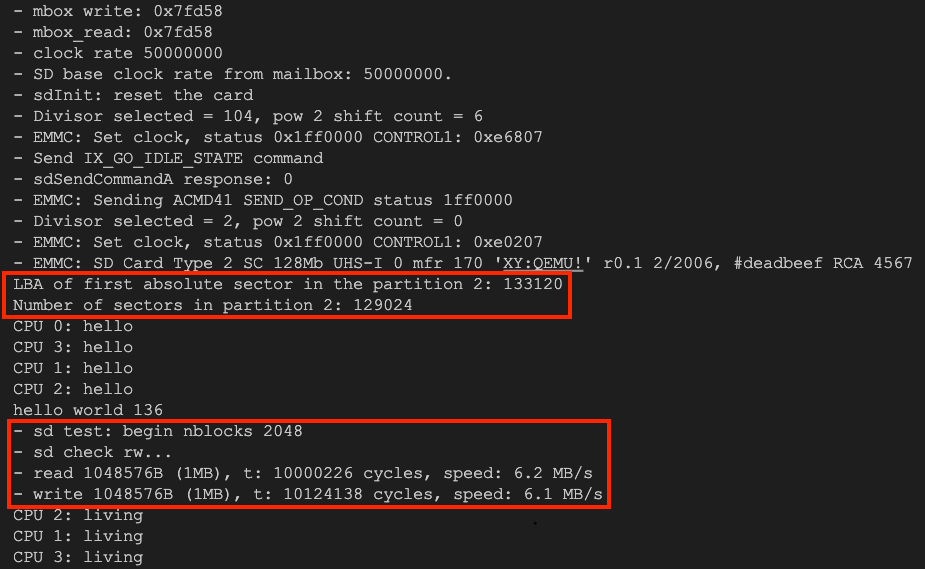
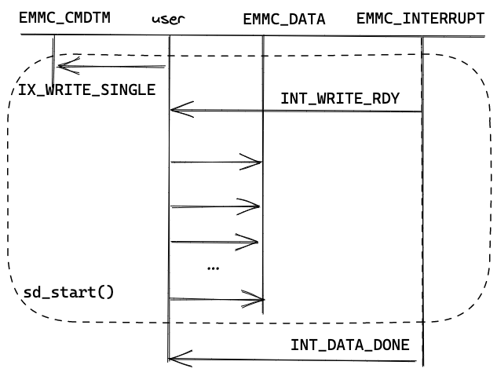
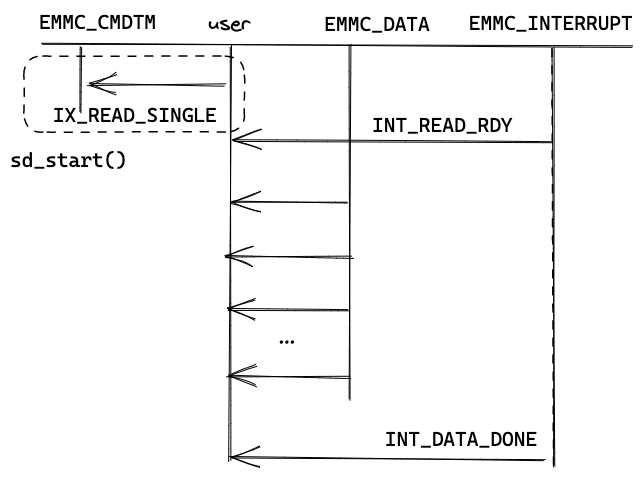
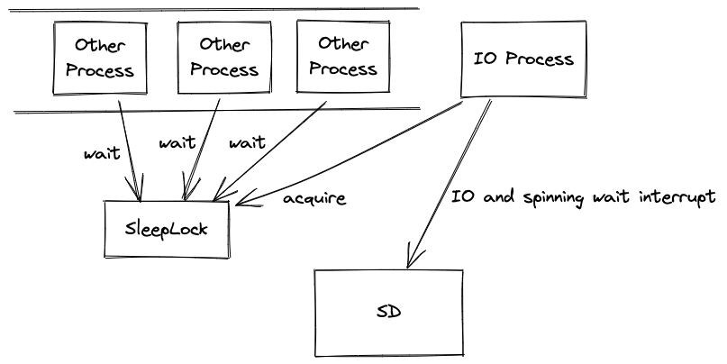
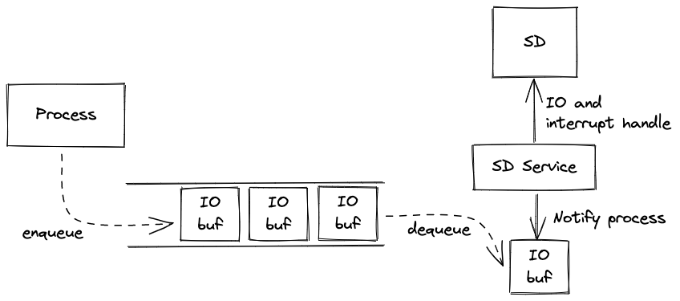

# Lab5

git commit hash: `git checkout ce6247628c2e133ee6df066bb79eb1a43c38af38`

## EMMC Interfaces

In this lab, we only use two commands of EMMC (`IX_WRITE_SINGLE` and `IX_READ_SINGLE`, for write/read a single block). The interfaces of these two commands are:

1. User writes command to `EMMC_CMDTM` (and args).
2. When EMMC is ready for read/write, it writes `INT_READ_RDY`/`INT_WRITE_RDY` to `EMMC_INTERRUPT`. User should handle and reset this interrupt.
3. User reads/writes data from/to `EMMC_DATA`.
4. When data is read/written out, EMMC interrupts with `INT_DATA_DONE`.

## Handling `EMMC_INTERRUPT`: Trap / Spinning Wait

There are two ways to handle `EMMC_INTERRUPT`:

1. If `EMMC_INTERRUPT` is non-zero *for a while*, CPU will trap into `IRQ_ARASANSDIO`. Therefore, we can handle it in interrupt handler.
2. Otherwise if it is cleared very soon after arrival, CPU will not trap. So we can spinning get and clear it.

The former wastes time in trap context switching and IPC (between interrupt handler and user process), while the later in spinning wait. In the benchmark test, *the later* has better performance.

## API Design: Block / Non-block

There are two kind of IO API designs:

1. Any process that wants to request IO acquires a `sd_lock` first (`SleepLock` makes it works like a FIFO wait list). Once process holds the lock, it does IO and handles interrupt (in `sdrw()`).

   

2. Process enqueues its request and waits for finish semaphore (or does some other job first). A process named `sd_service` dequeues request from the queue endlessly, does IO, handles interrupt and notifies process finnally.

   

The later implements an `overlapping` of IO, since processes can do other computation while waiting for IO. However it wastes some time in IPC (between processes and `sd_service`). Unfortunately, the benchmark test in this lab does not need other computation so that *the former* has the best performance.

## Conclusion

In this lab, we implement a *block*, *spinning wait* EMMC SD IO module. This schema of implementation is simple and performs well in the benchmark test.
