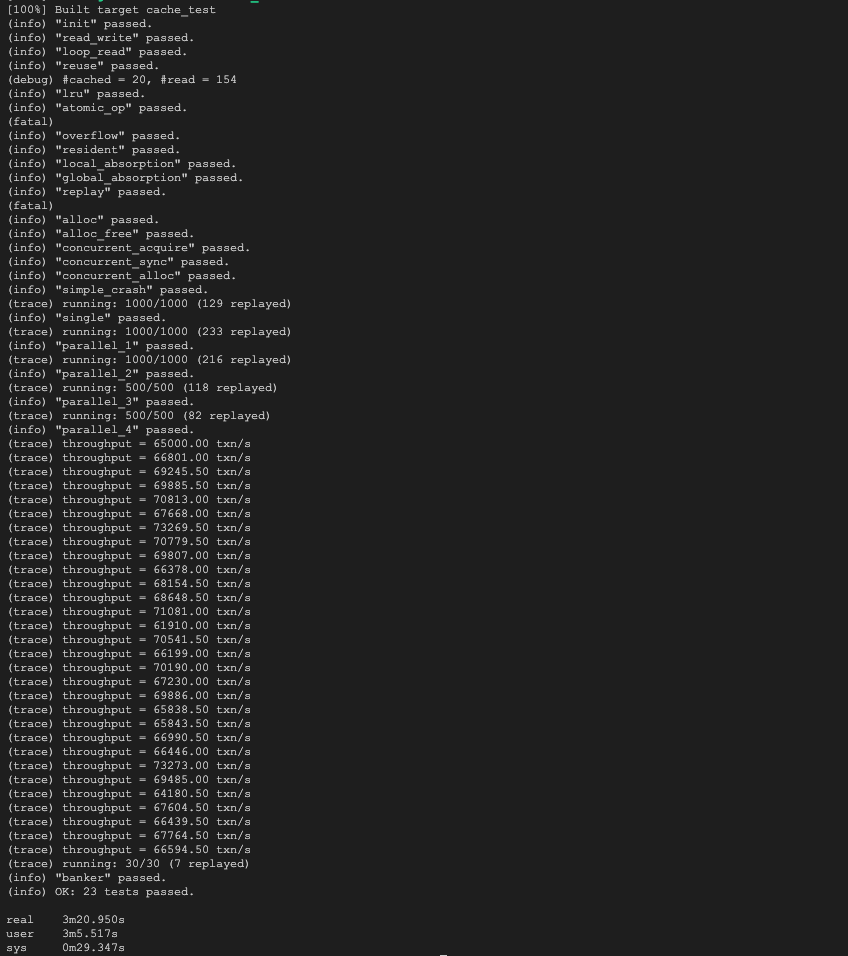

# Lab6

git commit hash: `git checkout c0252a7e6705ab6efa7f20b5da8b85842526a540`

## LRU `cache_acquire`/`cache_release`

All cache bloacks are organized by a doubly-linked list (for fast choosing evictor) and a RBTree (for fast searching).

`acquire`: Search `block_no` via RBTree. If found, move it to the last position of doubly-linked list (that means it should be the last to evict); Otherwise, load it from device, put it to the last position of linked list and insert it into RBTree. If the number of cache blocks is more than `EVICTION_THRESHOLD`, evict the first block which is NOT `acquire` and `pinned`.

`release`: Release lock of the block.

## Atomic Operation

`ctx` and `log` both have a `rb_root_` field to manage distinct blocks that modify in an / a group of OP(s).

`begin_op`: Increment `uncommitted`, decrement `rm` by `OP_MAX_NUM_BLOCKS`.

`sync`: Increment block `pinned`, add it to the RBTree of `ctx`.

`end_op`: Move all `rb_node` in the RBTree of `ctx` to `log`. Return unused `ctx->rm` to global `rm`. Decrement `uncommitted` and if it is the last committed txn, it should write log to the device.
